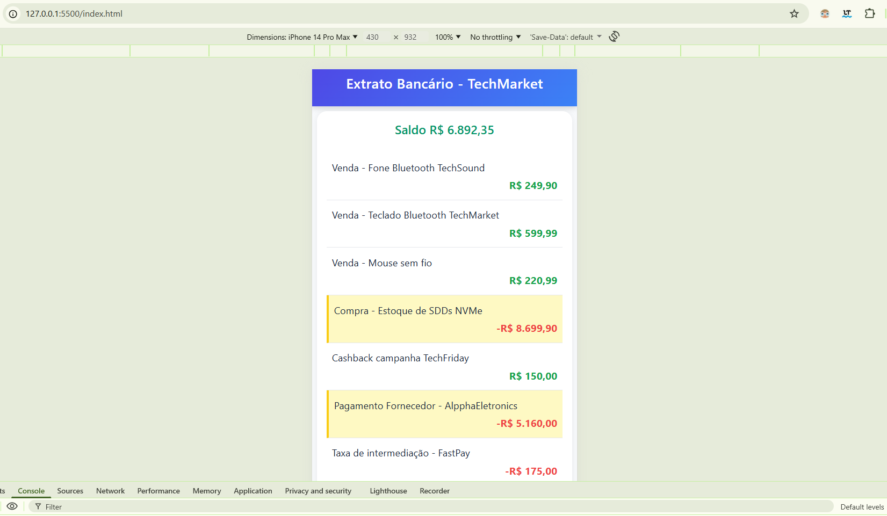
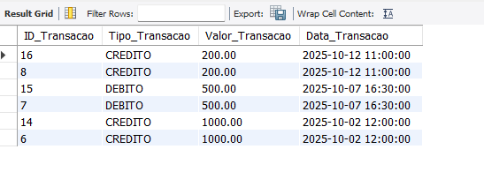
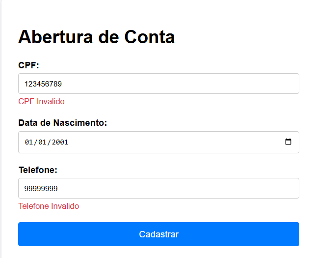

💼 Projeto TechMarket — Portfólio Integrador
🏫 Sobre o Projeto

Este projeto foi desenvolvido como parte do Portfólio Interdisciplinar da graduação em Análise e Desenvolvimento de Sistemas, com o objetivo de integrar diversas áreas da programação:

Desenvolvimento Web Responsivo (HTML, CSS, JavaScript)

Programação Backend (Node.js)

Banco de Dados (MySQL / SQL Procedure)

O sistema simula funcionalidades reais da empresa fictícia TechMarket, incluindo visualização de extratos, cálculos automáticos de saldo e validação de formulários.

📂 Estrutura do Projeto

PORTFOLIOINTERDISCIPLINAR/
│
├── INTEGRADOATV2/ # Programação Back-end (Node.js)
│ ├── index.js
│ ├── package.json
│
├── INTEGRADOATV3/ # Desenvolvimento Web Responsivo
│ ├── index.html
│ ├── style.css
│ ├── script.js
│
├── INTEGRADOATV4/ # Banco de Dados (MySQL)
│ └── procedure.sql
│
├── INTEGRADOATV5/ # Validação com JavaScript
│ ├── index.html
│ ├── style.css
│ ├── script.js
│
└── README.md # Documentação do projeto

⚙️ Tecnologias Utilizadas

HTML5

CSS3

JavaScript (DOM e validações)

Node.js

MySQL / MySQL Workbench

VS Code

Git e GitHub

📘 Atividades Realizadas
🔹 Passo 2 — Programação Backend (Node.js)

Criação de um servidor Node.js simples com Express e parser de requisições, garantindo melhor desempenho e leitura de dados no backend.

🔹 Passo 3 — Programação Web

Desenvolvimento de um extrato bancário responsivo, com destaque automático para valores acima de R$ 5.000, priorizando clareza e usabilidade mobile.

🔹 Passo 4 — Banco de Dados (MySQL)

Criação da procedure EP_ExtratoConta, responsável por:

Calcular o saldo de uma conta;

Listar as 10 últimas transações;

Permitir filtro por período informado pelo usuário.

🔹 Passo 5 — Validação com JavaScript

Implementação de validações automáticas em formulários:

CPF com 11 dígitos;

Data de nascimento válida;

Telefone em formato correto.

## 🖼️ PRINTS DAS ATIVIDADES FEITAS

### 💳 Extrato responsivo funcionando no navegador

### 🧮 Procedure rodando no MySQL Workbench — mostrando saldo e transações

### 📋 Formulário validando CPF e telefone

🧠 Aprendizados

Durante o desenvolvimento, aprimorei meus conhecimentos em lógica de programação, integração entre front-end e banco de dados, além de boas práticas de organização de código e versionamento no GitHub.
